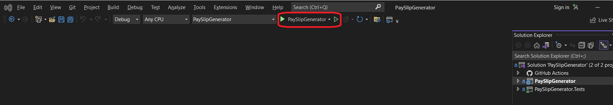

# Monthly Payslip Generator

## About the Project

The Salary Slip Generator allows you to generate salary slips for employees based on their provided information. This document provides a detailed explanation of how to use the API & Web UI.
</br>The application is build in .NET 6.
</br>The Web UI is built using Vite + React + Typescript

## Live Demo

- API docs: https://salaryslip.azurewebsites.net/swagger/index.html
- API endpoint: https://salaryslip.azurewebsites.net/api/v1/PaySlipGenerator
  </br>[See here about api details](#API-Details)
- Front-End Web Interface: https://salaryslipapp.azurewebsites.net/

## Getting Started

To get a local copy up and running, please follow these simple steps.

### Prerequisites

Here is what you need to be able to run Salary Slip Generator locally

- Visual Studio 2022 (recommended)
- .Net 6 SDK
- Node.js (Version: >=15.x <17)

## Local Setup

### Clone/download the code

1. Clone the repo or download it.

   ```sh
   git clone https://github.com/vndpal/monthly-payslip-generator.git
   ```

### API Setup

1. To run Monthly Pay Slip Generator API locally, navigate to `PaySlipGenerator` folder.

   ```sh
   cd PaySlipGenerator
   dotnet run
   ```

2. If you want to run it in `Visual Studio`, then in `Visual Studio` open the solution file `PaySlipGenerator.sln` present inside `PaySlipGenerator` folder.
3. After this run the project using run button or press `F5` key to run.
   
4. Make sure `PaySlipGenerator` project is set as startup project.
5. This will open up `Swagger` UI and all the details of the API will be available

### Front-end UI setup

1. To run front-end UI, navigate to `cliet/salaryslipporrtal` folder

   ```sh
   cd cliet/salaryslipporrtal
   ```

2. Install all the dependencies using below command

   ```sh
   npm i
   ```

3. Run the front-end UI with below command

   ```sh
   npm run dev
   ```

4. If you get any error while running the Web UI locally after following above steps, please make sure that API endpoint is configured correctly in `.env.development`.
   Currently it is configured to read API from `VITE_API_BASE_URL=https://localhost:7213/api/v1` port `7213`, please modify if API is running at different port at your machine.

# Monthly Payslip Generator API Documentation

## Introduction

The Salary Slip Generator API is a service that allows you to generate salary slips for employees based on their annual salary, super rate, and pay period. By sending a POST request to the API endpoint with appropriate data in the request body, you can receive a detailed salary slip for the given employee.

<a id="API-Details"></a>

## API Endpoint

- API URL: `https://salaryslip.azurewebsites.net/api/v1/PaySlipGenerator`
- Request Type: `POST`

## Request Body

The request body should be a JSON object containing the following parameters:

| Parameter    | Type   | Description                                                          |
| ------------ | ------ | -------------------------------------------------------------------- |
| firstName    | string | First name of the employee.                                          |
| lastName     | string | Last name of the employee.                                           |
| annualSalary | number | Employee's annual salary (before taxes).                             |
| superRate    | string | Employee's superannuation rate as a string percentage (e.g., "10%"). |
| payPeriod    | number | Pay period for the salary slip (e.g., 11 for November).              |

Example Request Body:

```
{
    "firstName": "Vinod",
    "lastName": "Pal",
    "annualSalary": 12505066,
    "superRate": "10%",
    "payPeriod": 11
}
```

## Response Body

The API will respond with a JSON object containing the following fields:

| Field       | Type   | Description                                                                             |
| ----------- | ------ | --------------------------------------------------------------------------------------- |
| name        | string | Full name of the employee.                                                              |
| payPeriod   | string | Pay period for which the salary slip is generated. The format is "DD Month - DD Month". |
| grossIncome | number | Gross income of the employee (before taxes).                                            |
| incomeTax   | number | Income tax deducted from the employee's salary.                                         |
| netIncome   | number | Net income of the employee (after taxes).                                               |
| super       | number | Superannuation contribution for the employee.                                           |

Example Response Body:

```
{
    "name": "Vinod Pal",
    "payPeriod": "01 November - 30 November",
    "grossIncome": 1042088.83,
    "incomeTax": 404757.98,
    "netIncome": 637330.85,
    "super": 104208.88
}
```

## HTTP Status Codes

The API may return the following HTTP status codes:

- **200 OK**: The request was successful, and the salary slip details are provided in the response body.

- **400 Bad Request**: The request is malformed or missing required parameters. Check the request body and try again.

- **500 Internal Server Error**: An error occurred on the server while processing the request. Please try again later.

## Error Handling

In case of any errors, the API will return a JSON object with an error message for easier debugging:

**Example Error Response:**

```json
{
  "error": "Invalid super rate. Please provide the rate as a percentage (e.g., '10%')."
}
```

## TODO

- **Authentication & Authorization**: The API does not have any rate-limiting at the moment and anyone can access it to calculate their taxes.
- **Rate limiting**: The API does not have any rate-limiting at the moment, but excessive and abusive requests may be blocked to ensure fair usage for all users.

## Trade-Offs

- **GET vs POST** - Opted for POST instead of GET because we have a complex input structure, browsers doesn't cache post request by default, and POST is easier to configure future input structure.
- **CORS Allowed** - Allowed CORS to all applications so that anyone can integrate it. For internal or SASS projects this should be only for few allowed applications.

## Assumptions

- **Tax slabs are configured correctly** - Tax slabs rates are configured correctly by the admin/support team.
- **Applicable to current tax structure only**: The API currently only support current tax structure.
- **Maximum Salary Restricted to 999999999**: The API has set a maximum salary limit of 999999999. Any salary value entered beyond this limit will result in a 400 Bad Request error. However, if needed, the API's maximum salary limit can be increased to accommodate higher values.
